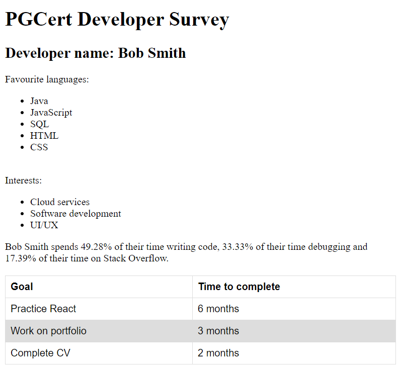
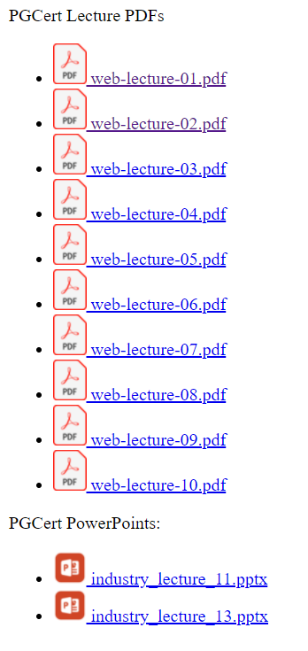

Remember that for each question you will need to run `npm install`. 

Read the questions carefully as you will need to create some files for each question. 

You will need to create some new route handler functions ('handler functions') for some exercises. These are just the `app.post("/YOUR-URL` functions that handle requests on the server side.

Question One (25 marks):
==============

For question one, you will process the form data that is submitted from `home.handlebars` and render it within a new handlebars file you create.

Spend some time looking at the form and checking you understand what will be submitted and processed.

Look carefully at the input elements in the form so you understand the structure of the data that will be submitted. You will have to do some programming with some of the data on the server-side so read the questions carefully and think about what the structure of the data coming from the form will be. Use console logs when you are unsure of the data.

When completed, the page that is generated from the submitted data should look something like this depending on what data you enter in the form:

You may complete these steps in different orders depending on how you like to write and debug your code. The important thing is that the data from the form is processed correctly and the result is displayed in handlebars and appears similar to the image above. For all list items (`li` elements) and table rows (`tr` elements), these should be created through looping/`{{#each ...}}` in handlebars. For the data that goes in the table ('goal' and 'time to complete'), you will need to structure this data in the server so that you can loop through it in handlebars. 

Step one (3 marks):
-----------

Create a handler function in `question-01.js` that will be able to handle a request from the form. Choose a sensibly chosen path for this request so you know the URL path that you can connect the form to the handler function. 

Setup the `action` and `method` attributes in the HTML form within `home.handlebars` so that the form will submit a request to the handler function you created. The form should use the `POST` method.

Test that your handler function is working correctly by testing that you can submit the form. You may want to use a console log to check that the request has gone through to the server.

Step two (3 marks):
-----------

Create a handlebars file that can be used to generate an HTML response the client; choose a sensible name for this handlebars file. Setup the handler function you created in step one so that it will render the handlebars file with `res.render(...)`. There will be nothing in this page yet but you should test each step is rendering before you move onto the next.

Step three (3 marks):
---------------

Using the data coming from the form request, get the data from the user's name from the form input. Setup the data with `res.locals...` so that it can be rendered in handlebars. 

Setup the title and subtitle of the handlebars page as per the image above. `Developer name: ...` should display the user's name as it was input from the form.

Test that you can input a name in the form and display it in handlebars.

Step four (5 marks):
---------------

In this step, you will display one list/`ul` for `Favourite languages` and one for `Interests` as can be seen in the image above. This data will be input from the two different checkboxes in the form.

Carefully examine the structure of the form again so that you understand what data will be available in your handler function and make sure you can do the steps necessary to display all of the `Favourite languages` and `Interests` in two separate lists in Handlebars as per the image above. You will need to loop through the data in Handlebars.

If for `Favourite languages` and/or `Interests` there are no boxes checked, a list should not be created and a message saying `no Favourite languages/Interests` selected instead. This should be done in Handlebars. 

Test that data from the check boxes in the forms will display as outlined above.

Step five (5 marks):
----------------

For this step you will be working with the form data related to weekly hours spent on `Writing code`, `Debugging` and `Stack Overflow`.Check how this data is entered in the form to understand how to access it in your handler code.

In your handler function, convert the data for total weekly hours for`Writing code`, `Debugging` or `Stack Overflow` to percentages so we know what percentage of the total time developing is spent on each of the 3 activities. 

 The total time is just the total number of the three categories combined; you will need to calculate to be able to calculate your percentages. Set the data to be rendered in the response and in your Handlebars file use the percentages to create a message similar to the message in the image above about how much time the developer spends on each category. Test that you can enter hours spent in the form and they can be displayed as percentages in the rendered handlebars file as can be seen in the example image above.

Step six (6 marks):
----------

In this step, you will create a table based on the data submitted in the `goals` and `goalsTime` inputs. This will be displayed within a table you create in your Handlebars file as can be seen in the image above. Pay attention to how the form data is structured. 

The suggested approach is to create an array of goal objects so that each goal object has a 'goal' property and 'goalTime' property so that the table rows can be generated with Handlebars by loop through each object. Create all of the necessary code to create this data and generate the table based on this data. Test that you can input and view data.

Question Two (25 marks):
==============

In this activity you will display and link to PDF and PowerPoint files from the server. You will also create a basic form to upload files. You may not have worked with PDF or PowerPoint files before but accessing them and linking to them is no different than any other file.

You will see in the `public/files` directory that there are several `pdf`, `pptx` and `.png` files. You will need to display a list of PDF files and a list of PPTX files. The .`png` files are icons that you will use for the links. 

This is what the final version should look like:

Step one: (3 marks)
----------

Create a handler function so that when requests are received to `/`, the `pgcertfiles.handlebars` file will be used to generate the response. Check that the handler function is working and connecting with handlebars.

Step two: (7 marks)
-----------

Using `fs` and whatever other JavaScript you need, get an array of filenames from the `public/files` directory. 

From this list of file names, you are going to want to create two separate arrays of PowerPoint and PDF file names.

Write the code you need to create the array of PowerPoint file names and PDF file names in the handler function. 

Set these lists of file names up to be accessible in Handlebars.

Step three: (7 marks)
-------------

In the `pgcertfiles.handlebars` file, create a list (`ul` & `li` elements) of PDF files and a list (`ul` & `li` elements) of PowerPoint filenames to display like the image above. Each list item should be a clickable link that links to the actual file. 

You should also use the `pdf` and `pptx` icons with each link to add an `img` element beside the text as can be seen in the demo image. Make sure to test it and that when you click on any of the links, it will either browse to or download the file. 

Step four: (8 marks)
---------------

Now create a file upload form at the bottom of your main page that will allow you to upload new files to the server's `files` directory. 

You should also create a new handler function to handle the file upload; e.g. `app.post("/YOUR-URL", function(req...`. Your file up load form will need to use the `POST` method and follow other requirements for file uploads.

This should complete the file upload and then redirect back to the main page. When it is complete, test that you can upload new files and that your links to files work correctly. Remember that file uploads will require using `fs` and `multer`. These have been included in configurations so you just need to use them correctly.
